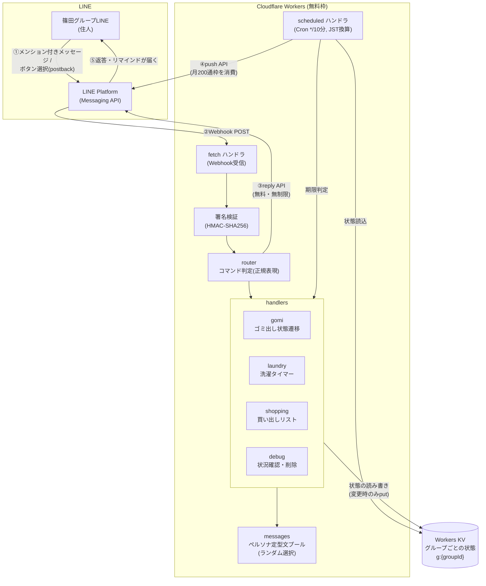

# 篠田の妖精さん 🧚

篠田ビルのグループLINEに住み着く、綺麗好きな妖精のリマインドbot。
ゴミ出し(火・金)、洗濯タイマー、買い出しリストを管理して、サボると呆れて、ちゃんとやると褒めてくれる。

## アーキテクチャ



ポイント: **ユーザーへの返答はすべてreply(無料)**、botから自発的に送るリマインドだけがpush(有料枠)を消費する。

## 機能ざっくり

| 機能 | 入力(要メンション) | リマインド |
|---|---|---|
| ゴミ出し | 「まとめた」「捨てた」 | 火・金の20〜23時に1時間おき。捨てたら停止 |
| 洗濯 | 「洗濯」「干した」「洗濯キャンセル」 | 開始40分後・50分後(完了)、以降30分おき。完了から3時間で自動停止 |
| 買い出し | 「〇〇を買ってくる」「〇〇買った」「〇〇削除」 | 指定日の15/18/21時。未完了なら翌日に繰り越し(最大3品目) |
| デバッグ | 「debug」「デバッグ」 | 登録状況の一覧表示+ボタンで削除 |
| ヘルプ | 「ヘルプ」 | コマンド一覧 |

## ⚠️ 使用上の注意

### 月にどれくらい使えるか(LINE無料プランの200通枠)

LINEのコミュニケーションプラン(無料)は **push送信が月200通まで**。しかも**グループへの1回のpushは「グループ人数分」カウント**される(2人グループなら1回=2通)。

```
月間消費 = リマインド送信回数 × グループ人数 ≦ 200通
```

リマインド1回あたりの送信回数の目安:

| 行動パターン | ゴミ出し(月9日) | 洗濯1回 | 買い出し1品目 |
|---|---|---|---|
| すぐやる人 | 1回/日 → 9回/月 | 2回(40分前+完了) | 1回 |
| 放置する人 | 4回/日 → 36回/月 | 最大9回(催促6回+打切り) | 3回/日×繰り越し日数 |

**試算例(月あたりのpush回数)**

- ちゃんとやる場合: ゴミ9 + 洗濯(週3×2回)26 + 買い出し(月8品×1.5回)12 ≒ **約50回/月**
  - → 2人で約100通 ✅ / 3人で約150通 ✅ / 4人で約200通 ⚠️ギリギリ
- サボりがちな場合: **最大120回/月程度**
  - → 2人で240通 ❌超過の恐れ

つまり: **2〜3人のグループで、リマインドされたら早めに「捨てた」「干した」「買った」と報告する運用なら余裕**。サボるほど妖精の小言が増えて枠を食う(本人へのペナルティとして機能する設計)。

### 枠を超えるとどうなる?

- 月の途中で200通に達すると、**それ以降のリマインドは月末まで送信されない**(エラーになるだけで課金はされない)。翌月1日に自動回復
- メンションへの返答(reply)は枠と無関係なので、**コマンド操作は枠切れ中も普通に使える**

### 残量の確認と節約

- 残量確認: [LINE Official Account Manager](https://manager.line.biz/) のホームに今月の送信数が表示される
- 消費が多いときは `wrangler.jsonc` の `vars` で調整して `wrangler deploy`:
  - `GOMI_END_HOUR`: `"22"` にすると夜の催促が1回減る
  - `LAUNDRY_GIVEUP_AFTER_MIN`: `"120"` にすると洗濯の催促が2回減る
  - `SHOPPING_HOURS`: `"15,21"` にすると買い出し催促が1日1回減る

### その他の注意

- **リマインドは最大10分ずれる**(Cronが10分間隔のため)。洗濯完了通知が「50〜60分後」になるのは仕様
- **メンション必須**: グループ内の通常会話には一切反応しない。スタンプや画像にも反応しない
- グループに招待した時点で自動登録される。**退会させると状態は全削除**される
- Cloudflare側の無料枠(10万リクエスト/日、KV書込1,000/日)は本用途では使い切れないので気にしなくてよい
- シークレット(`LINE_CHANNEL_SECRET` / `LINE_CHANNEL_ACCESS_TOKEN`)はコードに書かずwrangler secretで管理。**チャネルアクセストークンは漏れたら再発行**すること

## 開発メモ

```bash
npm run dev        # ローカル起動
npx tsc --noEmit   # 型チェック
npm run deploy     # デプロイ
```

文言の追加・変更は `src/messages.ts` を編集してデプロイ。仕様の詳細は要件定義書・設計書(別ファイル)を参照。
